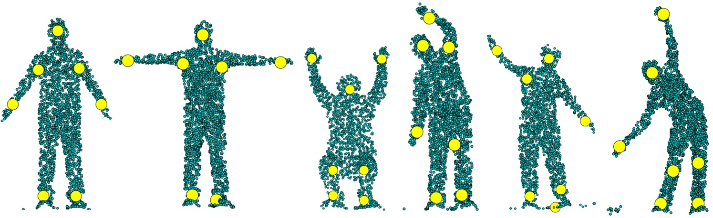
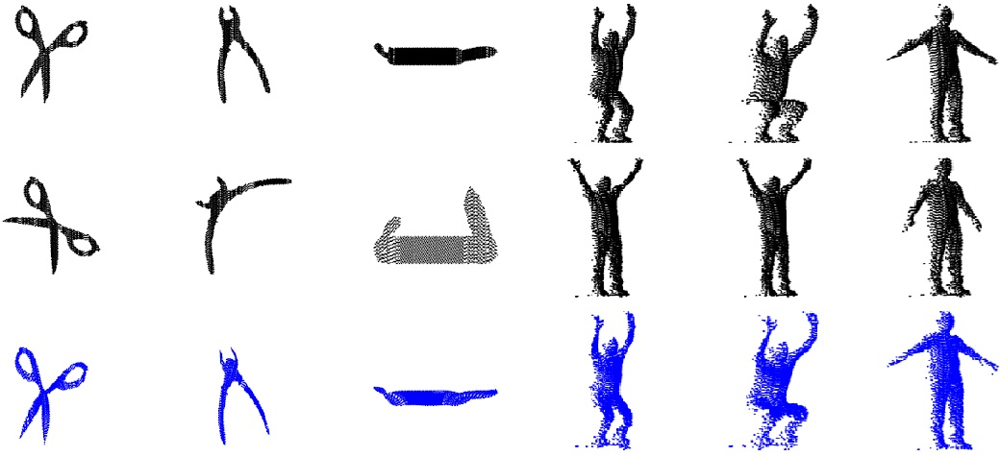
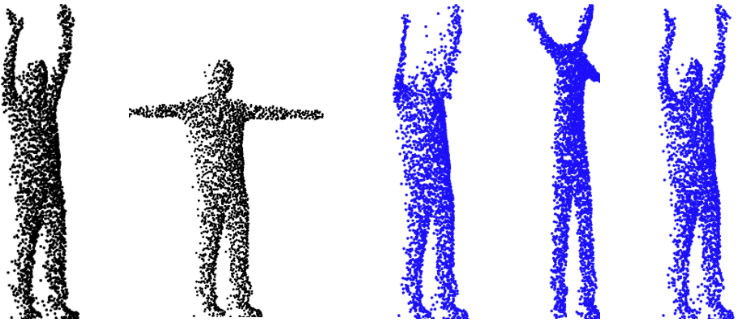
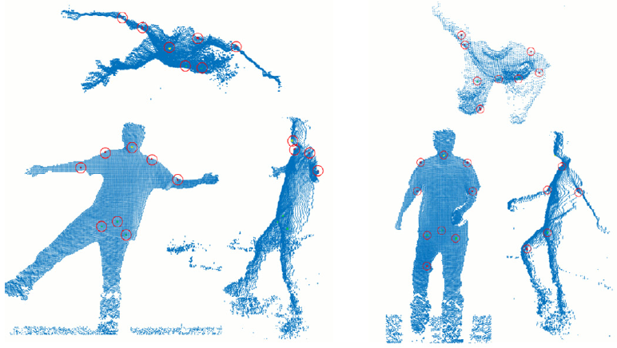

# Welcome

    My research interests include point set registration, human pose estimation, semi-supervised learning, computer vision, machine learning, artificial intelligence.
       
    I am a Clinical Assistant Professor at the University of North Texas (UNT), Denton. My research is on <b>Non-rigid registration of point set with large and uneven deformation</b> such as (3D) point sets representing complex articulated human poses. To achieve accurate non-rigid registration in such challenging cases, my work uses both local neighborhood constraint and global shape constraint in the registration. To preserve the local neighborhood structure during registration, I use constraints such as Stochastic Neighbor Embedding (SNE) or Locally Linear Embedding (LLE). I use Keypoint (or landmark) correspondences as a global shape constraint that enforces the alignment of corresponding keypoints between the point sets. To accurately identify the keypoints and their correspondences between the point sets, I use region-aware cluster-based feature descriptor or unsupervised deep learning techniques.
      
    Prior to joining the PhD program at the UNT, I worked in the industry for about 9 years. During that period, I was involved in many projects which includes embedded programming, font (web font) technologies, web development. I have both academic and real-world working experiences in many programming languages (and frameworks) such as C/C++, C#, .NET, Python, PyTorch, Matlab, Objective-C, Java, Javascript etc.
      
    <em>Keywords: Non-rigid registration, large deformation, depth cameras (rgb-d), deep learning, unsupervised learning, local structure, global shape</em>

---

## Publications

**Registration of Human Point Set using Automatic Key Point Detection and Region-aware Features**  
[**Amar Maharjan**](), [Xiaohui Yuan](https://scholar.google.com/citations?user=4F2la7sAAAAJ&hl=en)  
Proceedings of the IEEE/CVF Winter Conference on Applications of Computer Vision (WACV), 2022, pp. 741-749.  
[(paper)](https://openaccess.thecvf.com/content/WACV2022/papers/Maharjan_Registration_of_Human_Point_Set_Using_Automatic_Key_Point_Detection_WACV_2022_paper.pdf)  

---
**Non-rigid point set registration: recent trends and challenges**  
[Xiaohui Yuan](https://scholar.google.com/citations?user=4F2la7sAAAAJ&hl=en), [**Amar Maharjan**]()  
Artificial Intelligence Review, Springer, 56, 4859–4891 (2023).  
[(paper)]("https://link.springer.com/article/10.1007/s10462-022-10292-4)  

---
**Non-rigid registration of point clouds using landmarks and stochastic neighbor embedding**  
[**Amar Maharjan**](), [Xiaohui Yuan](https://scholar.google.com/citations?user=4F2la7sAAAAJ&hl=en), Qiang Lu, Yuqi Fan, and Tian Chen  
Journal of Electronic Imaging 30(3), 031202 (5 January 2021).  
[(paper)](https://doi.org/10.1117/1.JEI.30.3.031202)  

---
[//]: <> [Project 3 Title](http://example.com/)
**Point Set Registration of Large Deformation Using Auxiliary Landmarks**  
[**Amar Maharjan**](), [Xiaohui Yuan](https://scholar.google.com/citations?user=4F2la7sAAAAJ&hl=en),  
2nd International Conference on Urban Intelligence and Applications, 86-98, 2020.  
[(paper)](https://link.springer.com/chapter/10.1007/978-981-33-4601-7_9)  

---
**A hybrid framework for automatic joint detection of human poses in depth frames**  
[L. Kong](https://scholar.google.com/citations?user=XBTLbyQAAAAJ&hl=en), [Xiaohui Yuan](https://scholar.google.com/citations?user=4F2la7sAAAAJ&hl=en), and [**Amar Maharjan**]()  
Pattern Recognition, vol. 77, pp. 216–225, 2018.  
[(paper)](https://www.sciencedirect.com/science/article/abs/pii/S0031320317305162)  

---
**Selection of an Intermediate Representation for Program Analysis and Optimization**  
[**Amar Maharjan**]()  
2008.

---

## Projects

[SkyFonts](https://skyfonts.com/)
* Cross-platform desktop-based cloud application that installs fonts from different service providers (like google, fonts.com, linotype, myfonts) into the user’s machine.
* Main features include auto font installation, removal, login-logout service, font searching.

---
[FontSquare]()
* iOS mobile application that installs Google fonts into the mobile device. It has features like searching fonts, searching fonts by categories, selecting fonts, installing fonts, removing fonts, show detail font information etc.

---
[iManageProject]()
* Online web application for project management. Visual Studio 2010 as main IDE using C# as programming language. MsSql Server 2008 as backend, 2010.
* Features: Login system, create projects, to-do lists, milestones, dashboard, writeboard, time tracking, chatting.

---
[Customer Relationship Management (CRM)b]()
* Web application using Visual Studio 2008 using VB as programming language in DASS Pvt. Ltd. (CarThink, USA). Backend in MSSQL Server 2005. Features: Login system, Email system,Searching facilities, Reports etc.

---
[Reliability And Monitoring Program (RAMP)]()
* Desktop database application using Visual Studio 2005 using C# as programming language in DASS Pvt. Ltd. (A J Walter Aviation, UK).
* Features: Data entry, update, deletion, search. Showing and coloring in data grid view etc.

---
[Reliability And Monitoring Program (RAMP)]()
* Embedded programming using C in DASS Pvt. Ltd, (Tietech, Japan).
* Maintained modules of NVR. (http requests & response, formatting & detecting disks).
